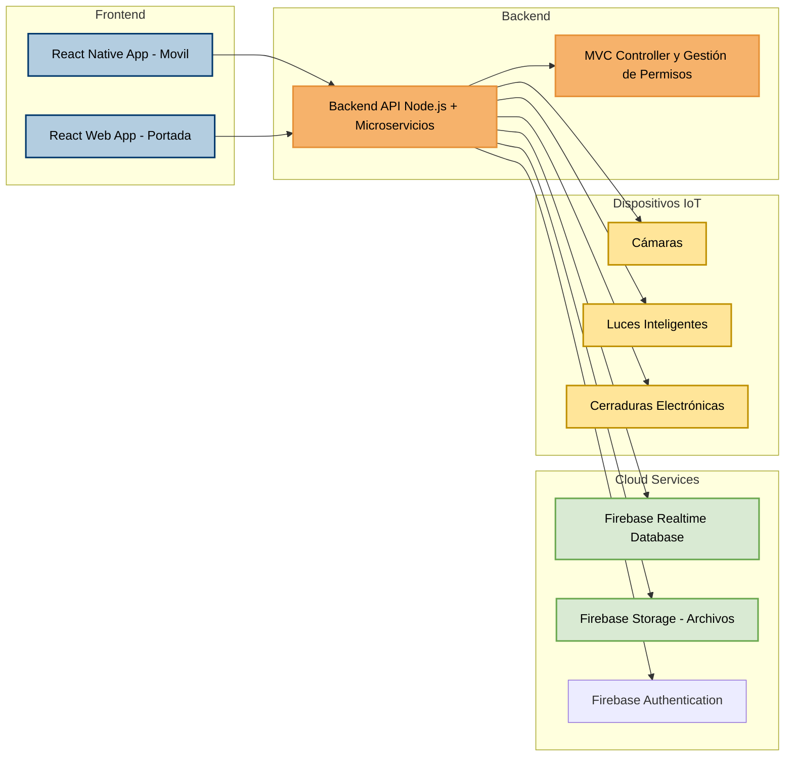
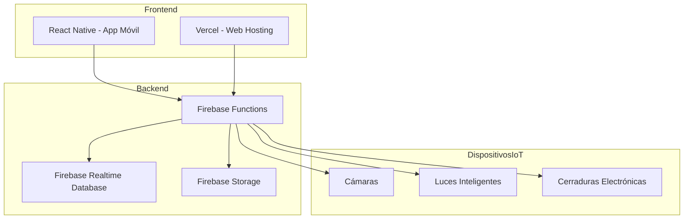
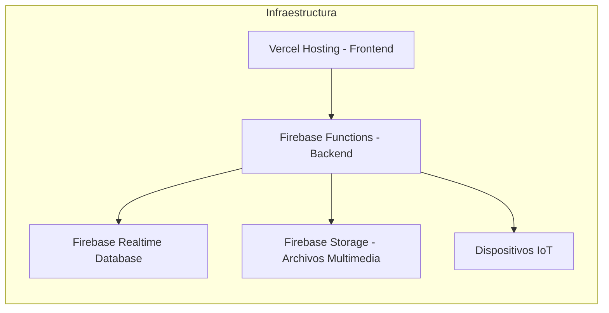
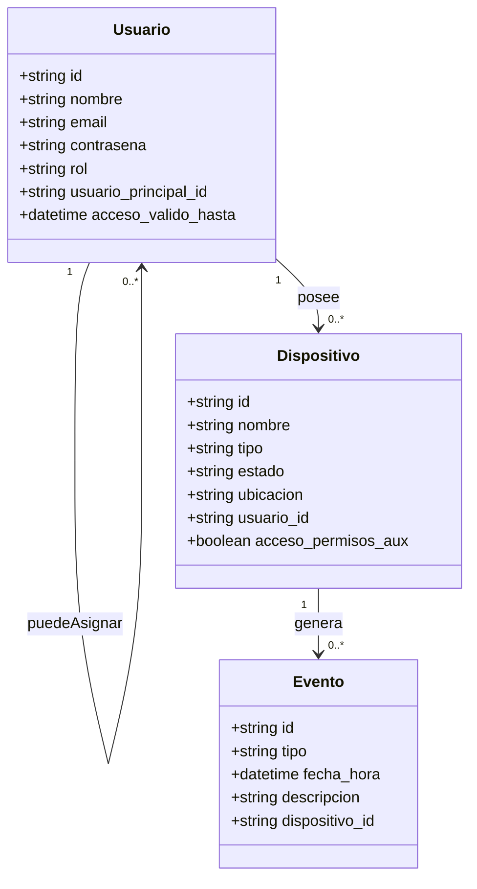
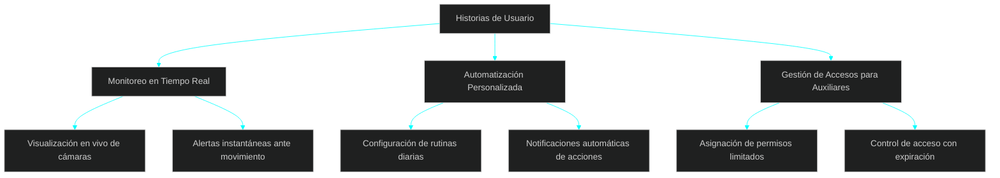
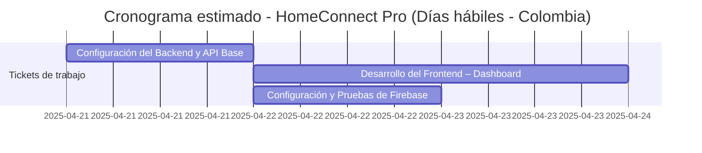

## Índice

0. [Ficha del proyecto](#0-ficha-del-proyecto)  
1. [Descripción general del producto](#1-descripción-general-del-producto)  
   - [1.1. Objetivo](#11-objetivo)  
   - [1.2. Propósito del producto](#12-propósito-del-producto)  
   - [1.3. Público objetivo](#13-público-objetivo)  
   - [1.4. Características y funcionalidades principales](#14-características-y-funcionalidades-principales)  
   - [1.5. Diseño y experiencia de usuario](#15-diseño-y-experiencia-de-usuario)  
   - [1.6. Instrucciones de instalación](#16-instrucciones-de-instalación)  

2. [Arquitectura del sistema](#2-arquitectura-del-sistema)  
   - [2.1. Diagrama de arquitectura](#21-diagrama-de-arquitectura)  
   - [2.2. Descripción de componentes principales](#22-descripción-de-componentes-principales)  
   - [2.3. Descripción de alto nivel del proyecto y estructura de ficheros](#23-descripción-de-alto-nivel-del-proyecto-y-estructura-de-ficheros)  
   - [2.4. Infraestructura y despliegue](#24-infraestructura-y-despliegue)  
   - [2.5. Seguridad](#25-seguridad)  
   - [2.6. Tests](#26-tests)  

3. [Modelo de datos](#3-modelo-de-datos)  
   - [3.1. Diagrama del modelo de datos](#31-diagrama-del-modelo-de-datos)  
   - [3.2. Descripción de entidades principales](#32-descripción-de-entidades-principales)  
   - [3.3. Reglas de acceso y control](#33-reglas-de-acceso-y-control)  

4. [Especificación de la API](#4-especificación-de-la-api)  
   - [4.1. Autenticación y autorización](#41-autenticación-y-autorización)  
   - [4.2. Esquema general de rutas](#42-esquema-general-de-rutas)  
   - [4.3. Endpoints detallados](#43-endpoints-detallados)  
   - [4.4. Autenticación](#44-autenticación)  

5. [Historias de usuario](#5-historias-de-usuario)  
   - [5.1 Historia de Usuario 1: Monitoreo en Tiempo Real](#51-historia-de-usuario-1-monitoreo-en-tiempo-real)  
   - [5.2 Historia de Usuario 2: Automatización Personalizada](#52-historia-de-usuario-2-automatización-personalizada)  
   - [5.3 Historia de Usuario 3: Gestión de Accesos para Usuarios Auxiliares](#53-historia-de-usuario-3-gestión-de-accesos-para-usuarios-auxiliares)  

6. [Tickets de trabajo](#6-tickets-de-trabajo)  
   - [Ticket 1: Configuración del Backend y API Base](#ticket-1-configuración-del-backend-y-api-base)  
   - [Ticket 2: Desarrollo del Frontend – Dashboard](#ticket-2-desarrollo-del-frontend---dashboard)  
   - [Ticket 3: Configuración y Pruebas de Firebase](#ticket-3-configuración-y-pruebas-de-firebase)  
   - [Cronograma estimado](#cronograma-estimado)  

7. [Pull requests](#7-pull-requests)


---

## 0. Ficha del proyecto

### **0.1. Tu nombre completo:**
Andres Camilo Buitrago Gómez
### **0.2. Nombre del proyecto:**
HomeConnect Pro
### **0.3. Descripción breve del proyecto:**

### **0.3. Descripción breve del proyecto:**

HomeConnect Pro es una aplicación para dispositivos móviles y laptops que permite controlar y monitorear dispositivos inteligentes del hogar desde una sola plataforma. Su objetivo principal es ofrecer mayor seguridad, automatización y comodidad a los usuarios mediante funciones como el control remoto de luces, cámaras, cerraduras, notificaciones en tiempo real y rutinas personalizadas.

Este proyecto simula un desarrollo profesional de software abarcando todas las fases del ciclo de vida: análisis, documentación, diseño, implementación (frontend, backend, infraestructura), pruebas y despliegue. Se priorizan buenas prácticas de arquitectura y código para facilitar su evolución y mantenimiento en futuras versiones.


### **0.4. URL del proyecto:**

> Puede ser pública o privada, en cuyo caso deberás compartir los accesos de manera segura. Puedes enviarlos a [alvaro@lidr.co](mailto:alvaro@lidr.co) usando algún servicio como [onetimesecret](https://onetimesecret.com/).

> URL aún por definir. Será implementada utilizando servicios gratuitos para iniciar, como Firebase y Vercel.
### 0.5. URL o archivo comprimido del repositorio

> Puedes tenerlo alojado en público o en privado, en cuyo caso deberás compartir los accesos de manera segura. Puedes enviarlos a [alvaro@lidr.co](mailto:alvaro@lidr.co) usando algún servicio como [onetimesecret](https://onetimesecret.com/). También puedes compartir por correo un archivo zip con el contenido

Se creará el repositorio en GitHub para alojar el código, documentación y entregables. Accesos por definir al finalizar la primera etapa.

---

## 1. Descripción general del producto

**HomeConnect Pro** es una aplicación multiplataforma diseñada para facilitar el control y monitoreo de dispositivos inteligentes en hogares y oficinas. Con funcionalidades avanzadas como monitoreo en tiempo real, automatización personalizada y gestión de accesos, está orientada tanto a propietarios como a usuarios auxiliares (inquilinos/huéspedes), proporcionando tranquilidad, seguridad y eficiencia.

### **1.1. Objetivo:**

El objetivo de **HomeConnect Pro** es ofrecer una solución escalable para la gestión de dispositivos inteligentes. Dirigido a:

1. **Propietarios y dueños de inmuebles:** Control completo y administración de dispositivos, con la capacidad de otorgar accesos temporales a terceros.

2. **Inquilinos y huéspedes:** Permisos específicos para controlar dispositivos asignados y garantizar un entorno seguro.

### **1.2. Propósito del producto:**
El propósito de HomeConnect Pro es brindar una plataforma integral que permita a los usuarios monitorear, gestionar y automatizar dispositivos inteligentes de forma remota, segura y sencilla. Este producto está pensado para mejorar la comodidad, seguridad y eficiencia energética en el hogar y en oficinas mediante tecnología accesible, escalable y fácil de usar.

### **1.3. Público objetivo:**
Propietarios de viviendas o inmuebles inteligentes.

Inquilinos de largo o corto plazo (como huéspedes de Airbnb).

Administradores de oficinas que busquen controlar múltiples dispositivos desde una sola interfaz.

Usuarios interesados en automatización del hogar y tecnologías IoT.

### **1.4. Características y funcionalidades principales:**

1. **Monitoreo en Tiempo Real**:
   - Visualización de cámaras conectadas desde cualquier lugar y dispositivo.  
   - Capturas automáticas al detectar movimiento con alertas instantáneas.  

2. **Automatización Personalizada**:
   - Configuración de rutinas diarias para luces y cerraduras.  
   - Rutinas predefinidas para facilitar la programación del hogar..  

3. **Gestión de acceso seguro**:
	- Contraseñas personalizadas para usuarios principales y auxiliares.
	- Registros detallados de accesos (quién ingresó y cuándo).
	
4. **Usuarios Auxiliares**:
	- Creación de perfiles temporales con acceso restringido a dispositivos asignados.
	- Automatización de permisos basados en fechas de entrada y salida (ideal para temporales).

5. **Compatibilidad Multidispositivo**:
   - Sincronización fluida entre dispositivos móviles y laptops..  
   - Soporte multiplataforma (Android, iOS y navegadores).
   
### **1.5. Diseño y experiencia de usuario:**

El diseño se centra en una interfaz intuitiva y minimalista que facilite la interacción para usuarios de todos los niveles técnicos. Se priorizará:  
- **Pantallas limpias y organizadas** para gestionar dispositivos desde un panel principal.  
- **Acciones rápidas** como encender o apagar dispositivos con un solo clic.  
- **Alertas visuales y auditivas** en caso de intrusión o movimientos detectados.  

*Ejemplo:* Imagina abrir la app y visualizar un tablero central con accesos directos a tus cámaras, luces y cerraduras. Con un solo toque, puedes observar en tiempo real lo que sucede en tu hogar o activar automatizaciones preconfiguradas.

### **1.6. Instrucciones de instalación:**

#### **Backend**:
1. Clona el repositorio del backend:
   ```bash
   git clone <URL_BACKEND_REPOSITORIO>
   ```
2. Configura el entorno e instala las dependencias:
	```bash	
	cd backend
	npm install
	```
3. Configura las variables de entorno para la base de datos y las claves API.

4. Inicia el servidor local:
	```bash
	npm start
	```
#### **Frontend**:
1. Clona el repositorio del frontend:
	```bash
	git clone <URL_FRONTEND_REPOSITORIO>
	```
2. Instala las dependencias necesarias:	
	```bash
	cd frontend
    npm install
    ```
3. Inicia el servidor de desarrollo:	
	```bash
	npm start
	```
### **Base de Datos**:
#### **Base de datos con Firebase Realtime Database**

1. **Crea un proyecto en Firebase**:
   - Accede a [Firebase Console](https://console.firebase.google.com/) y haz clic en "Agregar proyecto".
   - Configura la seguridad inicial en modo estrictamente administrado.

2. **Activa la Realtime Database**:
	- En "Base de datos", selecciona "Crear base de datos".

	- Configura las reglas iniciales para controlar la autenticación:
```json
{
  "rules": {
    "usuarios": {
      "$uid": {
        ".read": "auth != null && auth.uid == $uid",
        ".write": "auth != null && auth.uid == $uid"
      }
    },
    "dispositivos": {
      "$dispositivoId": {
        ".read": "auth != null && root.child('usuarios').child(auth.uid).exists()",
        ".write": "auth != null && root.child('usuarios').child(auth.uid).exists()"
      }
    }
  }
}
```

3. **Pruebas iniciales**:

	- Añade datos dummy para probar jerarquías de permisos:
	```Json	
	{
	  "usuarios": {
		"usuarioPrincipal123": {
		  "nombre": "Propietario",
		  "rol": "dueño"
		},
		"usuarioAuxiliar456": {
		  "nombre": "Huésped",
		  "rol": "auxiliar",
		  "usuarioPrincipalId": "usuarioPrincipal123"
		}
	  },
	  "dispositivos": {
		"dispositivo123": {
		  "nombre": "Cámara Sala",
		  "tipo": "cámara",
		  "estado": "activo",
		  "usuarioId": "usuarioPrincipal123"
		}
	  }
	}
	```

4. **Configuración en el backend**:
   - Descarga el archivo `google-services.json` desde la configuración del proyecto en Firebase.
   - Coloca este archivo en la carpeta raíz de tu proyecto backend.

5. **Instala las librerías de Firebase**:
   ```bash
   npm install firebase-admin firebase
   ```
6. **Ejemplo de Conexión al backend:** Configura Firebase en tu archivo principal del backend:
	```Javascript	
	const admin = require("firebase-admin");
	const serviceAccount = require("./google-services.json");

	admin.initializeApp({
	  credential: admin.credential.cert(serviceAccount),
	  databaseURL: "https://<YOUR-DATABASE-NAME>.firebaseio.com"
	});

	const db = admin.database();
	module.exports = db;
	```	
7. **Prueba la conexión:** Agrega un nodo en la base de datos con un comando de prueba:
	```bash
	db.ref("prueba").set({
	  mensaje: "Conexión exitosa con Firebase"
	});
	```
	
---

## 2. Arquitectura del Sistema

### **2.1. Diagrama de arquitectura:**
La arquitectura está diseñada siguiendo principios de **cliente-servidor y microservicios**, asegurando una separación clara entre los componentes frontend, backend y servicios en la nube. Representamos esto con el siguiente diagrama en Mermaid:

## Diagrama de Arquitectura del Sistema




### **Patrones utilizados:**

- **Microservicios:** Para separar la lógica del backend y las integraciones con Firebase.

- **MVC (Model-View-Controller):** En el backend para organizar la estructura del código.

### **Beneficios:**

- **Escalabilidad:** Gracias a Firebase y su capacidad de manejar grandes volúmenes de datos.

- **Costo reducido:** Uso de servicios gratuitos para iniciar el desarrollo.

- **Migración sencilla:** El diseño permite trasladar fácilmente el sistema a AWS o Google Cloud en el futuro.

### **Explicación y Justificación de la Arquitectura**
1. **Patrón Cliente-Servidor y Microservicios**

- **Frontend:** Se compone de una aplicación móvil desarrollada en React Native y una aplicación web (por ejemplo, usando React) que se comunican con el backend a través de llamadas a la API. Esto garantiza una interfaz de usuario moderna y adaptable a múltiples dispositivos.

- **Backend:** Se utiliza un servidor Node.js/Express organizado con el patrón MVC para separar la lógica de presentación, negocio y acceso a datos. La adopción de microservicios facilita la escalabilidad, el mantenimiento y la incorporación de nuevas funcionalidades de forma independiente.

2. **Integración con Servicios en la Nube**

- **Firebase Realtime Database:** Se utiliza para el almacenamiento y la sincronización en tiempo real de datos críticos, lo que es clave para el monitoreo de dispositivos y alertas en tiempo real.

- **Firebase Storage:** Gestiona el almacenamiento de archivos y multimedia (por ejemplo, imágenes de cámaras), integrándose fácilmente con el backend.

3. **Control y Monitoreo de Dispositivos IoT**

- **Dispositivos IoT:** Se incluye un bloque específico para dispositivos inteligentes como cámaras, luces y cerraduras. El backend se encarga de emitir órdenes y recibir datos de estos dispositivos, permitiendo el control remoto y el monitoreo de seguridad.

4. **Integración de Firebase Authentication:**

	- La autenticación ahora permite establecer jerarquías entre usuarios principales (dueños) y usuarios auxiliares (huéspedes/inquilinos). Estas jerarquías son esenciales para proporcionar acceso seguro y personalizado.

	- Los permisos específicos son gestionados dinámicamente:

		- Por ejemplo, un usuario auxiliar puede controlar únicamente luces y cerraduras asignadas por el usuario principal, sin acceso a cámaras.

**Justificación**
1. Jerarquías Claras y Escalabilidad:

	- Este diseño permite una separación clara de roles, adaptándose a escenarios como Airbnb o cualquier entorno con usuarios temporales.

	- La implementación inicial es flexible y escalable, permitiendo agregar más tipos de usuarios (por ejemplo, técnicos de mantenimiento).

2. **Optimización de Seguridad:**

	- Los permisos basados en roles evitan accesos no autorizados, utilizando las reglas de seguridad de Firebase para limitar las operaciones que cada usuario puede realizar.

	- **Ejemplo:** Un usuario auxiliar no puede agregar nuevos dispositivos ni modificar configuraciones sensibles.


5. **Beneficios y Sacrificios**

- **Beneficios:**

	- **Escalabilidad:** La separación en microservicios y el uso de Firebase permiten escalar cada componente según la demanda.

	- **Mantenimiento y Extensibilidad:** La estructura basada en MVC y la separación de responsabilidades facilitan la incorporación de nuevas funcionalidades y el mantenimiento del código.
	
	- 

	- **Costo Reducido y Desarrollo Ágil:** Utilizar servicios en la nube gratuitos o de bajo costo para el prototipo permite iniciar el desarrollo de forma rápida y económica.

- **Sacrificios/Desafíos:**

	- **Complejidad Inicial:** La adopción de microservicios y la integración con múltiples servicios en la nube pueden incrementar la complejidad del desarrollo inicial.

	- **Dependencia de Terceros:** El uso de Firebase implica depender de las limitaciones y políticas del proveedor, lo que podría representar un riesgo si se necesita migrar a otra plataforma en el futuro.

	- **Latencia y Seguridad:** La comunicación en tiempo real entre dispositivos y la nube debe estar bien asegurada para evitar vulnerabilidades o latencias en las notificaciones y comandos críticos.

Esta arquitectura es coherente con los requerimientos del proyecto y permite una solución robusta y escalable para el control y monitoreo de dispositivos inteligentes. Se justifica su uso por la facilidad de integración, el costo reducido en fases iniciales y la capacidad de evolucionar el sistema a medida que crece la demanda.

### **2.2. Descripción de componentes principales:**

1. **Frontend:**

- **Tecnología:** React Native y React para desarrollo móvil y web.

- **Propósito:** Proveer una interfaz intuitiva y responsiva para usuarios en dispositivos móviles y laptops para monitorear y gestionar dispositivos inteligentes..

- **Interacciones:** Envía y recibe datos del backend a través de APIs.

2. **Backend:**

- **Tecnología:** Node.js con Express, organizado bajo el patrón MVC y arquitectura basada en microservicios.

- **Propósito:**
	- Implementar la lógica de negocio.
	- Gestionar autenticación y permisos.
	- Procesar solicitudes del frontend relacionadas con dispositivos IoT y usuarios.

- **Interacciones:**
	- Se conecta con Firebase Authentication para validar el acceso de usuarios.
	- Almacena y recupera datos desde Firebase Realtime Database.
	- Controla dispositivos inteligentes mediante protocolos HTTP y MQTT.
	- Define rutas RESTful para que el frontend interactúe con todos los servicios.


3. **Cloud Services:**

- **Realtime Database:** Almacena y sincroniza datos críticos en tiempo real.

- **Firebase Storage:** Almacenamiento de archivos multimedia (imágenes, videos).

4. **Dispositivos IoT:**

- **Propósito:** Comunicarse con dispositivos inteligentes como cámaras, bombillas y cerraduras.
	- **Cámaras:** Monitoreo en tiempo real con generación de alertas.

	- **Luces Inteligentes:** Automatización según horario o detección de movimiento.

	- **Cerraduras Electrónicas:** Control de acceso seguro mediante contraseña.

- **Protocolos utilizados:** HTTP y MQTT para conectar y controlar los dispositivos.

5. **Firebase Authentication:**
- **Tecnología**: Firebase Authentication.

- **Propósito**:

	- Gestionar la autenticación de usuarios principales y auxiliares.

	- Garantizar accesos diferenciados según el tipo de usuario.

- **Interacciones**:

	- Los usuarios principales tienen acceso completo para:

		- Asignar dispositivos a usuarios auxiliares.

		- Controlar permisos y actividades de cada usuario auxiliar.

	- Los usuarios auxiliares pueden interactuar únicamente con los dispositivos asignados, según las reglas establecidas por el usuario principal.


### **2.3. Descripción de alto nivel del proyecto y estructura de ficheros**

```plaintext
HomeConnectPro/
├── frontend/
│   ├── src/
│   │   ├── components/       # Componentes reutilizables (botones, cards, menús)
│   │   ├── screens/          # Pantallas principales de la app (Login, Dashboard, etc.)
│   │   ├── services/         # Lógica de conexión con la API y Firebase
│   │   └── styles/           # Estilos globales y personalizados (CSS-in-JS o estilos base)
│   ├── package.json          # Dependencias y scripts del frontend
│   └── README.md             # Documentación técnica del frontend
├── backend/
│   ├── src/
│   │   ├── controllers/      # Controladores que manejan la lógica de negocio y rutas
│   │   ├── models/           # Modelos de datos y esquemas de permisos/usuarios
│   │   ├── routes/           # Definición de endpoints del API (REST)
│   │   └── utils/            # Funciones auxiliares (helpers, middlewares, validaciones)
│   ├── package.json          # Dependencias y scripts del backend
│   └── server.js             # Punto de entrada del backend (Express)
└── LICENSE                   # Licencia del proyecto (MIT, GPL, etc.)
```

### Propósito de las Carpetas:
- `frontend/src/components`: Contiene los componentes reutilizables como botones, menús, tarjetas de dispositivo, íconos, etc.

- `frontend/src/screens`: Define las pantallas principales de navegación, como el login, dashboard, perfil, y panel de control.

- `frontend/src/services`: Se encarga de manejar las llamadas a la API y servicios de Firebase (auth, base de datos, storage).

- `frontend/src/styles`: Aloja los estilos globales o temáticos, como temas oscuros, variables de color y diseño responsivo.

- `backend/src/controllers`: Aquí va la lógica que responde a las rutas del API; organiza las funciones por dominio (auth, devices, users).

- `backend/src/models`: Define las estructuras de datos utilizadas en el backend, incluyendo el esquema de usuarios, permisos y dispositivos.

- `backend/src/routes`: Agrupa las rutas REST que permiten la interacción del frontend con la lógica del sistema.

- `backend/src/utils`: Contiene funciones reutilizables como validaciones, middlewares para manejo de errores o logs, y control de acceso.

### **2.4. Infraestructura y despliegue**



**Procesos de Despliegue**
1. **Frontend**

	- La app móvil está desarrollada en React Native.

	- La versión web se despliega mediante Vercel, lo que permite una entrega continua, rápida y sin complicaciones.

2. **Backend**

	- La lógica del servidor se implementa como funciones serverless usando Firebase Functions.

3. **Base de Datos**

	- Se usa Firebase Realtime Database para mantener la sincronización de datos en tiempo real entre la app, el backend y los dispositivos.

4. **Almacenamiento de Archivos**

	- Firebase Storage aloja archivos como imágenes capturadas por cámaras o configuraciones personalizadas del usuario.

5. **Dispositivos IoT**

	- El backend se comunica con los dispositivos inteligentes (cámaras, luces, cerraduras) utilizando protocolos como HTTP y MQTT para control en tiempo real.
	
---

**Beneficios**
- **Modularidad:** Separación clara entre frontend, backend y servicios IoT.

- **Bajo costo inicial:** Ideal para prototipos o MVPs, gracias al uso de planes gratuitos.

- **Escalabilidad:** Listo para migrar fácilmente a soluciones como Google Cloud o AWS en fases futuras.

- **Despliegue continuo:** Facilita actualizaciones rápidas y controladas desde Vercel y Firebase.

**Sacrificios o Desafíos**
	- **Alta dependencia de Firebase:** Puede ser un reto si en el futuro se decide migrar la infraestructura.

	- **Complejidad en la configuración inicial:** Especialmente al integrar seguridad en tiempo real entre IoT y la nube.

	- **Limitaciones de funciones serverless:** Hay que considerar restricciones como tiempos máximos de ejecución o número de invocaciones en planes gratuitos


### **2.5. Seguridad**

- **Cifrado de datos:** Toda la comunicación entre el frontend y el backend se realiza mediante HTTPS.

- **Autenticación robusta:** Se implementa con Firebase Authentication, aplicando reglas personalizadas para restringir el acceso.

- **Reglas de Firebase:** Se configuran para asegurar que solo los usuarios autorizados accedan a datos críticos.

**Prácticas implementadas**

1. **Cifrado de datos:**

- Se fuerza el uso de HTTPS para todas las comunicaciones, protegiendo los datos durante el tránsito.

- Ejemplo de configuración en Express:
	```Javascript
	const enforce = require("express-sslify");
	app.use(enforce.HTTPS({ trustProtoHeader: true }));
	```
2. **Autenticación robusta:**

- Los usuarios se autentican mediante correo electrónico o Google Login usando Firebase Authentication.

- Ejemplo de reglas en Firebase Realtime Database:
	```Json
	{
	  "rules": {
		".read": "auth != null",
		".write": "auth != null"
	  }
	}
	```
	
3. **Restricción de acceso a datos sensibles:**

- Solo los usuarios autenticados pueden acceder a imágenes u otros archivos almacenados en **Firebase Storage**.

- Ejemplo de reglas de seguridad en Firebase Storage:
	```plaintext
	service firebase.storage {
	  match /b/{bucket}/o {
		match /imagenes/{allPaths=**} {
		  allow read, write: if request.auth != null;
		}
	  }
	}
	```

### **2.6. Tests**

Se realizarán pruebas unitarias, de integración, funcionales, de seguridad y automatizadas para garantizar que toda la arquitectura 
esté alineada con el modelo de datos y permisos descrito en el numeral **"3. Modelo de Datos"**.

1. **Pruebas Unitarias**
	- **Objetivo:** Verificar que los componentes individuales del sistema funcionen correctamente de manera aislada.
	- **Cobertura clave:**
		- **Firebase Authentication:**
			- Validar que los usuarios principales puedan crear usuarios auxiliares con éxito.

			- Confirmar que los auxiliares tengan acceso limitado solo a los dispositivos asignados.

			- Verificar que los accesos se desactiven automáticamente tras la fecha accesoValidoHasta.

		- **Reglas en la base de datos:**
			- Probar que las reglas de seguridad de Firebase Realtime Database bloqueen accesos indebidos.

			- Ejemplo: Un usuario auxiliar no debe poder acceder a dispositivos no asignados.

2. **Pruebas de Endpoints del Backend**
- **Objetivo:** Validar el correcto funcionamiento de los endpoints y cumplimiento de reglas de negocio.

- **Endpoints críticos:**
	- **Gestión de Usuarios:**
			- Crear usuarios auxiliares y verificar validaciones de rol del usuario principal.

	- **Control de Dispositivos:**
			- Asegurar que los auxiliares solo interactúan con sus dispositivos asignados.
			- Impedir que modifiquen configuraciones globales del sistema.

3. **Pruebas Funcionales**
- **Objetivo:** Validar el comportamiento completo del sistema en escenarios reales de uso.

- **Escenarios simulados:**

		- **Caso 1:** Un propietario crea un auxiliar y le da acceso a una cerradura. El auxiliar la desbloquea exitosamente.

		- **Caso 2:** El propietario elimina los permisos del auxiliar. Este ya no puede acceder al dispositivo.

		- **Caso 3:** Eventos como "desbloqueo exitoso" son registrados correctamente en Firebase.

---

4. **Pruebas de Seguridad**
- **Objetivo:** Proteger datos sensibles y evitar accesos no autorizados.

- **Controles verificados:**

	- **Acceso indebido:**

		- Simular intento de acceso a dispositivos no permitidos y confirmar bloqueo.

	- **Cifrado de contraseñas:**

		- Validar almacenamiento seguro usando hashing (por ejemplo, bcrypt).

	- **Reglas de Firebase:**

		- Comprobar que las operaciones de lectura/escritura se permiten solo si `auth != null`.

---

5. **Pruebas de Automatización**
- **Objetivo:** Validar tareas programadas y comportamientos automáticos del sistema.

- **Casos clave:**

	- **Vencimiento de accesos:**

		- Confirmar que el sistema revoca automáticamente los permisos tras la fecha `accesoValidoHasta`.

Automatización de dispositivos:

Verificar que luces y cerraduras reaccionan según las reglas de automatización (ej: encendido por horario).

---

## 3. Modelo de Datos

### **3.1. Diagrama del modelo de datos:**
Este diagrama representa la jerarquía entre usuarios principales y auxiliares, las relaciones con los dispositivos inteligentes, y el registro de eventos generados por el uso del sistema. 
Está modelado en formato Mermaid classDiagram, ideal para visualizar estructuras de tipo orientado a objetos o entidades-relaciones.



**Explicación del modelo**
1. **Usuario**
- **Relación jerárquica:** Un usuario puede ser "principal" (propietario) o "auxiliar" (invitado).

- **Permisos:** El campo acceso_valido_hasta define hasta cuándo un usuario auxiliar puede acceder.

- **Asignaciones:** Un usuario principal puede asignar múltiples usuarios auxiliares y controlar múltiples dispositivos.

2. **Dispositivo**
- Asignado a un único usuario.

- Incluye campos clave como `tipo`, `ubicacion` y `estado`.

- El campo `acceso_permisos_aux` permite o restringe el uso del dispositivo por parte de auxiliares.

3. **Evento**
- Representa acciones como desbloquear una cerradura, encender luces, o cualquier interacción.

- Siempre está vinculado a un dispositivo específico.

#### Notas sobre sintaxis Mermaid
📌 Estructura de atributos:
```diff
+tipo nombre
```
- `+` → Público.

- `tipo` → Tipo de dato (string, datetime, boolean).

- `nombre` → Nombre del atributo.

📌 ¿Y los modificadores como `PK`, `FK` o `UNIQUE`?

Mermaid no los exige ni los recomienda directamente para classDiagram.

Si se quisiera extender a un modelo relacional puro, esos modificadores se indicarían por convención o en un modelo ERD más detallado.

### **3.2. Descripción de entidades principales:**

> Recuerda incluir el máximo detalle de cada entidad, como el nombre y tipo de cada atributo, descripción breve si procede, claves primarias y foráneas, relaciones y tipo de relación, restricciones (unique, not null…), etc.

Esta sección describe cada una de las entidades clave en el sistema, incluyendo sus atributos, propósito y relaciones principales. 
Son la base para comprender cómo interactúan los usuarios, los dispositivos y los eventos en **HomeConnect Pro**.

1. **Usuario**
- **Descripción:** Representa a cualquier persona con acceso al sistema, ya sea como propietario (usuario principal) o como invitado (usuario auxiliar).

- **Atributos clave:**

	- `id`: Identificador único del usuario.

	- `nombre`: Nombre del usuario.

	- `email`: Correo electrónico utilizado para autenticación.

	- `contrasena`: Contraseña cifrada del usuario.

	- `rol`: Define si el usuario es "principal" o "auxiliar".

	- `usuario_principal_id`: (solo si es auxiliar) hace referencia al usuario que le otorgó acceso.

	- `acceso_valido_hasta`: Fecha límite en la que el usuario auxiliar puede acceder al sistema.

- **Relaciones:**

	- Un usuario principal puede asignar múltiples usuarios auxiliares.

	- Puede controlar múltiples dispositivos.

2. **Dispositivo**
- **Descripción:** Representa un dispositivo inteligente dentro del hogar, como luces, cámaras o cerraduras.

- **Atributos clave:**

	- `id`: Identificador único del dispositivo.

	- `nombre`: Nombre que identifica el dispositivo en la app.

	- `tipo`: Tipo de dispositivo (ej. cámara, luz, cerradura).

	- `estado`: Estado actual del dispositivo (ej. encendido, apagado, bloqueado).

	- `ubicacion`: Lugar físico donde está instalado (ej. sala, entrada).

	- `usuario_id`: Usuario propietario del dispositivo.

	- `acceso_permisos_aux`: Indica si el dispositivo puede ser controlado por un usuario auxiliar.

- **Relaciones:**

	- Cada dispositivo pertenece a un único usuario.

	- Puede generar múltiples eventos.

3. **Evento**
- **Descripción:** Registro de acciones o interacciones realizadas sobre un dispositivo, como encender una luz o abrir una cerradura.

- **Atributos clave:**

	- `id`: Identificador único del evento.

	- `tipo`: Tipo de acción registrada (ej. "desbloqueo", "encendido").

	- `fecha_hora`: Fecha y hora exacta del evento.

	- `descripcion`: Texto explicativo o metadatos del evento.

	- `dispositivo_id`: Dispositivo relacionado con el evento.

- **Relaciones:**

	- Un evento está siempre asociado a un dispositivo.

💡 **Importante:** Esta estructura permite una trazabilidad completa sobre qué usuario ejecutó una acción, sobre qué dispositivo, y cuándo lo hizo. 
Además, permite implementar reglas de seguridad avanzadas y automatizaciones basadas en eventos.

---

### **3.3. Reglas de acceso y control:**
En **HomeConnect Pro**, el acceso a los datos y dispositivos está estrictamente controlado por medio de roles de usuario (principal vs. auxiliar) y reglas de seguridad definidas en Firebase Realtime Database y Firebase Storage. 
Esta lógica garantiza que cada usuario solo pueda interactuar con los recursos que le han sido asignados, reforzando la privacidad y seguridad del sistema.

**Roles de Usuario**
```markdown
|---------------|--------------------------------------------------------------------------------------|
| Rol           | Descripción                                                                          |
|---------------|--------------------------------------------------------------------------------------|
| **Principal** | Usuario propietario de dispositivos, con control total sobre su cuenta.              |
| **Auxiliar**  | Usuario invitado con permisos limitados y temporales definidos por el rol principal. |
|---------------|--------------------------------------------------------------------------------------|
```
**Reglas generales de acceso**
```markdown
|--------------------------|----------------------------------|---------------------------------------------------|
| Recurso                  | Usuario Principal                | Usuario Auxiliar                                  |
|--------------------------|----------------------------------|---------------------------------------------------|
| Crear dispositivos       | ✅ Permitido                     | ❌ No permitido                                  |
| Ver dispositivos         | ✅ Todos sus dispositivos        | ✅ Solo los asignados                            |
| Controlar dispositivos   | ✅ Todos sus dispositivos        | ✅ Solo si `acceso_permisos_aux = true`          |
| Ver eventos              | ✅ De todos sus dispositivos     | ✅ Solo si el dispositivo está asignado          |
| Crear usuarios auxiliares| ✅ Permitido                     | ❌ No permitido                                  |
| Ver usuarios auxiliares  | ✅ Permitido                     | ❌ No permitido                                  |
|--------------------------|----------------------------------|---------------------------------------------------|
```

**Reglas de seguridad en Firebase Realtime Database**
```json
{
  "rules": {
    "usuarios": {
      "$uid": {
        ".read": "auth != null && auth.uid === $uid",
        ".write": "auth != null && auth.uid === $uid"
      }
    },
    "dispositivos": {
      "$deviceId": {
        ".read": "auth != null && (
                    data.child('usuario_id').val() === auth.uid ||
                    (data.child('acceso_permisos_aux').val() === true &&
                     root.child('usuarios').child(auth.uid).child('usuario_principal_id').val() === data.child('usuario_id').val())
                 )",
        ".write": "auth != null && data.child('usuario_id').val() === auth.uid"
      }
    }
  }
}
```
---

**Lógica clave implementada:**

1. 🔒 Lectura controlada por propiedad o relación jerárquica.

2. ⛔ Escritura permitida solo al propietario del recurso.

3. ⏳ Acceso auxiliar dependiente de `acceso_valido_hasta` (validado en backend).

--- 

**Firebase Storage**
Los recursos multimedia como imágenes de cámaras estarán protegidos con reglas similares. 
Solo el propietario o el auxiliar autorizado podrá acceder a estos archivos.
```plaintext
service firebase.storage {
  match /b/{bucket}/o {
    match /imagenes/{allPaths=**} {
      allow read, write: if request.auth != null && (
        request.auth.uid == resource.metadata.usuario_id ||
        request.auth.token.usuario_principal_id == resource.metadata.usuario_id
      );
    }
  }
}
```

---

💡 **Nota:** Estas reglas pueden ser refinadas aún más en producción, añadiendo validaciones como expiración de permisos, verificación de roles desde `custom claims`, o separación por zonas geográficas.

---
## 4. Especificación de la API

> Si tu backend se comunica a través de API, describe los endpoints principales (máximo 3) en formato OpenAPI. Opcionalmente puedes añadir un ejemplo de petición y de respuesta para mayor claridad
### **4.1. Introducción**
Esta API RESTful permite la interacción entre el frontend y el backend del sistema HomeConnect Pro. Está organizada bajo el patrón MVC y desarrollada con Node.js + Express. Todas las rutas requieren autenticación previa con Firebase Authentication.

---

### **4.2. Esquema general de rutas**

```markdown
|--------|---------------------------------|-----------------------------------------------------|-------------------------|
| Método | Endpoint                        | Descripción                                         | Autenticación           |
|--------|---------------------------------|-----------------------------------------------------|-------------------------|
| POST   | `/api/auth/signup`              | Registrar nuevo usuario (principal o auxiliar)      | ❌                      |
| POST   | `/api/auth/login`               | Autenticar usuario y generar token de sesión        | ❌                      |
| GET    | `/api/users/me`                 | Obtener perfil del usuario autenticado              | ✅                      |
| POST   | `/api/users/:id/auxiliares`     | Crear usuario auxiliar                              | ✅ (solo Principal)     |
| GET    | `/api/users/:id/auxiliares`     | Listar auxiliares de un usuario principal           | ✅                      |
| POST   | `/api/devices`                  | Crear dispositivo                                   | ✅ (solo Principal)     |
| GET    | `/api/devices`                  | Listar dispositivos del usuario                     | ✅                      |
| PUT    | `/api/devices/:id/control`      | Controlar dispositivo (on/off, abrir/cerrar, etc.)  | ✅ (si permitido)       |
| GET    | `/api/devices/:id/events`       | Ver eventos de un dispositivo                       | ✅ (si asignado)        |
| POST   | `/api/permissions`              | Asignar permisos de dispositivo a auxiliar          | ✅ (solo Principal)     |
|--------|---------------------------------|-----------------------------------------------------|-------------------------|
```
---

### **4.3. Endpoints detallados**
Vamos a describir únicamente 3 endpoints principales en formato OpenAPI y explicar la elección de estos tres.

Estos endpoints están enfocados en la gestión de autenticación y la obtención de información del usuario, que son la base para asegurar el acceso y el manejo de permisos en el sistema. Escogimos:

1. POST /auth/signup: Para registrar nuevos usuarios, que permite la creación de cuentas (principal o auxiliar).

2. POST /auth/login: Para iniciar sesión y generar el token de autenticación, esencial para acceder a las demás funcionalidades.

3. GET /auth/profile: Para obtener los datos del usuario autenticado, verificando la validez del token y proporcionando la información necesaria para el cliente.

A continuación, el snippet de OpenAPI en formato YAML que documenta estos endpoints con ejemplos:
```yaml
openapi: 3.0.0
info:
  title: HomeConnect Pro API
  version: "1.0.0"
paths:
  /auth/signup:
    post:
      summary: "Registrar nuevo usuario"
      description: "Registra un usuario nuevo (principal o auxiliar)."
      requestBody:
        required: true
        content:
          application/json:
            schema:
              type: object
              properties:
                nombre:
                  type: string
                email:
                  type: string
                  format: email
                password:
                  type: string
              required:
                - nombre
                - email
                - password
      responses:
        "201":
          description: "Usuario creado exitosamente."
          content:
            application/json:
              schema:
                type: object
                properties:
                  message:
                    type: string
                  uid:
                    type: string
        "400":
          description: "Datos inválidos o email ya registrado."
  /auth/login:
    post:
      summary: "Iniciar sesión"
      description: "Autentica a un usuario y genera un token de sesión."
      requestBody:
        required: true
        content:
          application/json:
            schema:
              type: object
              properties:
                email:
                  type: string
                  format: email
                password:
                  type: string
              required:
                - email
                - password
      responses:
        "200":
          description: "Login exitoso. Retorna token y datos del usuario."
          content:
            application/json:
              schema:
                type: object
                properties:
                  token:
                    type: string
                  uid:
                    type: string
                  rol:
                    type: string
        "401":
          description: "Credenciales incorrectas."
  /auth/profile:
    get:
      summary: "Obtener perfil del usuario autenticado"
      description: "Retorna los datos del usuario que se encuentra autenticado mediante el token."
      security:
      - bearerAuth: []
      responses:
        "200":
          description: "Información del usuario autenticado."
          content:
            application/json:
              schema:
                type: object
                properties:
                  uid:
                    type: string
                  nombre:
                    type: string
                  email:
                    type: string
                  rol:
                    type: string
        "401":
          description: "Token inválido o expirado."
components:
  securitySchemes:
    bearerAuth:
      type: http
      scheme: bearer
      bearerFormat: JWT
```
**Explicación:**
- **POST /auth/signup:** Esencial para la creación de cuentas, permitiendo la incorporación de nuevos usuarios al sistema.

- **POST /auth/login:** Permite el inicio de sesión, generando el token de autenticación que se utilizará en futuras peticiones.

- **GET /auth/profile:** Facilita el acceso a la información del usuario autenticado, comprobando el token de seguridad.

Esta selección cubre el flujo básico de autenticación, que es la piedra angular para cualquier sistema seguro y escalable. 
La idea es que en **fases futuras**, si se requiere, se puedan extender con más endpoints (por ejemplo, cambio de contraseña, 2FA, etc.), 
pero por ahora estos tres son fundamentales y suficientes para el alcance actual del proyecto.

### **4.4. Autenticación**
El backend valida los tokens de Firebase enviados en cada solicitud. 
Los endpoints protegidos requieren que el token se incluya en el encabezado, tal como se muestra a continuación:
```makefile
Authorization: Bearer <token>
```
Esta estrategia de autenticación garantiza que solamente los usuarios autorizados puedan acceder a los recursos protegidos, proporcionando seguridad y control de acceso a nivel de API.

## 5. Historias de Usuario
Tres **historias de usuario principales**, siguiendo las buenas prácticas **"formato INVEST"** para que sean (independientes, negociables, valiosas, estimables, pequeñas y testeables).

### 5.1 **Historia de Usuario 1**: Monitoreo en Tiempo Real
**Como** usuario propietario,
**quiero** ver el video en vivo de las cámaras instaladas en mi hogar,
**para** mantener un monitoreo constante y recibir alertas instantáneas en caso de detección de movimiento o intrusión.

- **Criterios de aceptación:**

	- La app debe mostrar el video en vivo desde la cámara seleccionada.

	- Se deben generar alertas visuales y auditivas si se detecta movimiento.

	- El usuario debe poder seleccionar entre varias cámaras instaladas.
	
---

### 5.2 **Historia de Usuario 2**: Automatización Personalizada
**Como** usuario propietario,
**quiero** configurar rutinas diarias para automatizar el encendido y apagado de luces y cerraduras,
**para** optimizar el uso de energía y aumentar la seguridad de mi hogar sin tener que realizarlo manualmente.

- **Criterios de aceptación:**

	- El sistema permite configurar horarios para activar/desactivar dispositivos.

	- Se puede guardar y editar una rutina en el panel de control.

	- Las rutinas deben ejecutarse de manera automática y notificar al usuario en caso de error.
	
---

### 5.3 **Historia de Usuario 3**: Gestión de Accesos para Usuarios Auxiliares
**Como** propietario,
**quiero** asignar permisos limitados a usuarios auxiliares (por ejemplo, inquilinos o huéspedes),
**para** que ellos puedan controlar solo aquellos dispositivos a los que se les ha dado acceso, garantizando la seguridad y evitando cambios no autorizados.

- **Criterios de aceptación:**

	- El sistema permite crear cuentas auxiliares vinculadas a la cuenta principal.

	- Se puede establecer la duración del acceso mediante el campo acceso_valido_hasta.

	-Los auxiliares solo pueden interactuar con los dispositivos asignados y ver eventos relacionados a ellos.
---

< Estas tres historias de usuario cubren aspectos fundamentales del proyecto: el monitoreo en tiempo real, la automatización del hogar y la gestión segura de accesos. 
Esto no solo ayuda a guiar el desarrollo, sino que también sirve como base para definir las pruebas y el flujo de trabajo de la aplicación.

---




**Explicación breve:**
- **Monitoreo en Tiempo Real:** Permite ver en vivo las cámaras y recibir alertas si se detecta algún movimiento inusual.

- **Automatización Personalizada:** Facilita configurar rutinas (por ejemplo, encender luces a una hora determinada) y notificar cualquier incidencia en la ejecución.

- **Gestión de Accesos para Auxiliares:** Permite que el propietario asigne permisos a usuarios auxiliares, con control de duración y acceso restringido únicamente a dispositivos asignados.
---

## 6. Tickets de Trabajo

A continuación se documentan 3 tickets de trabajo principales, uno para el backend, otro para el frontend y uno enfocado en la configuración y pruebas de la base de datos. 
Cada ticket contiene la descripción de la tarea, el responsable (por definir), la prioridad, el tiempo estimado y los criterios de aceptación, siguiendo el **formato INVEST** (independiente, negociable, valioso, estimable, pequeño y testeable).

### **Ticket 1:** Configuración del Backend y API Base
- **Descripción:**
Configurar el entorno de desarrollo del backend implementado con Node.js y Express, establecer la estructura del proyecto usando el patrón MVC y desarrollar la API base para la autenticación y gestión de dispositivos.

- **Responsable:** [Agente_1]

- **Prioridad:** Alta

- **Tiempo estimado:** 8 horas

- **Criterios de aceptación:**

	- La estructura del proyecto debe estar organizada en directorios: `controllers`, `models`, `routes` y `utils`.

	- Implementación de endpoints básicos para autenticación: `/auth/signup`, `/auth/login` y `/auth/profile`.

	- Integración con Firebase Authentication y Firebase Realtime Database para validación de tokens y almacenamiento de datos.

	- Documentación de API base actualizada en el README y generación de ejemplos en formato OpenAPI.

---

### Ticket 2: Desarrollo del Frontend - Dashboard

- **Descripcion:**
Desarrollar el dashboard principal en el frontend utilizando React Native (y React para la versión web, si aplica) que permita visualizar en tiempo real el estado de los dispositivos, acceder a las funcionalidades de control y recibir notificaciones.

- **Responsable:** [Agente_2]

- **Prioridad:** Alta

- **Tiempo estimado:** 12 horas

- **Criterios de aceptación:**

	- Creación de componentes reutilizables en `frontend/src/components` (p. ej., tarjetas, botones, listas de dispositivos).

	- Implementación de pantallas en `frontend/src/screens`, con énfasis en la interfaz de usuario del dashboard.

	- Conexión y consumo de los endpoints de la API para mostrar datos de dispositivos y usuarios.

	- Incorporación de un sistema de notificaciones o alertas visuales para eventos en tiempo real.

	- Documentación de la interacción con la API y pruebas funcionales de la interfaz.
	
---
	
### **Ticket 3:** Configuración y Pruebas de Firebase
- **Descripción:**
Configurar la base de datos en Firebase Realtime Database, definir las reglas de seguridad que aseguren el acceso correcto según roles y realizar pruebas unitarias para garantizar que los permisos se apliquen conforme al modelo de datos.

- **Responsable:** [Nombre del desarrollador]

- **Prioridad:** Media

- **Tiempo estimado:** 6 horas

- **Criterios de aceptación:**

	- Creación del proyecto en Firebase y activación de la Realtime Database con las reglas de seguridad definidas.

	- Las reglas deben asegurar que sólo el usuario propietario pueda modificar sus datos y que los usuarios auxiliares tengan acceso restringido.

	- Implementación de un conjunto de datos dummy para realizar pruebas de acceso:

		- Un usuario principal con dispositivos asociados.

		- Usuarios auxiliares con permisos limitados.

	- Pruebas unitarias que validen:

		- Que un usuario auxiliar no puede acceder a dispositivos no asignados.

		- Que se respeten los límites temporales de acceso definidos por `acceso_valido_hasta`.

	- Documentación en el repositorio sobre las reglas y ejemplos de testeo.

---

Este set de tickets cubre las áreas críticas del proyecto: establecer un backend robusto, desarrollar una interfaz de usuario intuitiva y segura, y garantizar que la base de datos aplique correctamente los controles de acceso. Esto permitirá mantener un flujo de trabajo ágil y acorde al desarrollo profesional que se espera

---
**Nota de Planeación**
>Nota: El tiempo de ejecución del proyecto se iniciará a partir de que se apruebe la viabilidad de esta documentación inicial. 
Se estima que la planificación operativa comenzará el 2025-04-21.
### **Cronograma estimado**.



---
## 7. Pull Requests

> Documenta 3 de las Pull Requests realizadas durante la ejecución del proyecto

**Pull Request 1**

**Pull Request 2**

**Pull Request 3**

